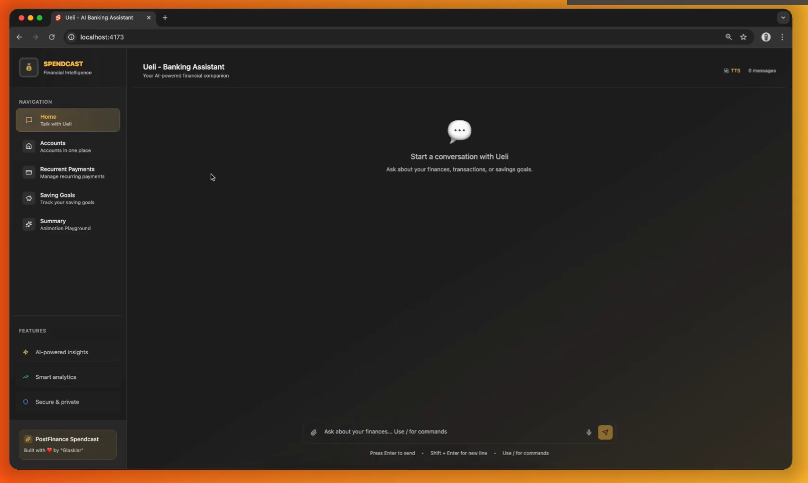

# SpendCast 💰🎙️

**Bring your finances to life with AI-powered conversations**



Built during [BärnHäckt 2025](https://www.bernhackt.ch) - A hackathon project that transforms personal finance data into engaging, conversational experiences.

## 🏆 Challenge: PostFinance SpendCast

SpendCast is an intelligent, multimodal financial assistant that uses generative AI, knowledge graphs, and AI agents to provide personalized, natural language responses about your spending habits. Think Spotify Wrapped, but for your finances.

## ✨ Features

- 🗣️ **Natural Language Queries**: Ask questions like "How much did I spend on unhealthy food last month?"
- 🎵 **Text-to-Speech**: Get responses as spoken audio using Chrome TTS
- 🎤 **Speech-to-Text**: Voice input support via Chrome STT
- 📊 **Animated Visualizations**: Beautiful slide presentations using Animotion
- 🧠 **AI Agent Orchestra**: Intelligent agents coordinate data access and analysis
- 🕸️ **Knowledge Graph Integration**: Connects personal data with external sources (Open Food Facts, Wikidata)
- 🎯 **MCP Protocol**: Model Context Protocol for seamless data source integration
- 📱 **Responsive UI**: Modern interface built with ShadCN components and Tailwind CSS

## 🛠️ Tech Stack

### Frontend

- **SvelteKit** - Full-stack framework
- **ShadCN/UI** - Component library
- **Tailwind CSS** - Utility-first styling
- **Animotion** - Animated presentation slides
- **Chrome Web APIs** - TTS/STT integration

### Backend

- **Hono** - Lightweight web framework
- **LLM Query Layer** - Custom data querying system
- **AI Agents** - Orchestrated intelligence system
- **MCP (Model Context Protocol)** - Data source dumping and querying

### Architecture

- **Microservices** - Distributed service architecture
- **Knowledge Graphs** - Structured data relationships

### Planned/WIP Features

- **OCR System** - Document text extraction (unfinished)
- **External APIs** - Open Food Facts, Wikidata integration

## 🏗️ Architecture Overview

```
┌─────────────────┐    ┌─────────────────┐    ┌─────────────────┐
│   SvelteKit     │    │   Hono API      │    │   LLM Query     │
│   Frontend      │◄──►│   Gateway       │◄──►│   Layer         │
│                 │    │                 │    │                 │
└─────────────────┘    └─────────────────┘    └─────────────────┘
         │                       │                       │
         ▼                       ▼                       ▼
┌─────────────────┐    ┌─────────────────┐    ┌─────────────────┐
│   Chrome APIs   │    │   AI Agents     │    │  Knowledge      │
│   (TTS/STT)     │    │   Orchestrator  │    │  Graph          │
└─────────────────┘    └─────────────────┘    └─────────────────┘
```

## 💬 Usage Examples

<iframe width="560" height="315" src="https://www.youtube.com/embed/8hJrAomTCUc?si=5_ZSlDhXcD8qnfeE" title="YouTube video player" frameborder="0" allow="accelerometer; autoplay; clipboard-write; encrypted-media; gyroscope; picture-in-picture; web-share" referrerpolicy="strict-origin-when-cross-origin" allowfullscreen></iframe>

### Voice Interactions

- "How much did I spend on groceries this month?"
- "What's my biggest spending category?"
- "Show me my unhealthy food expenses as a podcast"

### Response Formats

- 🎵 **Audio**: Spoken responses and podcast-style summaries
- 📊 **Visual**: Animated charts and infographics
- 📱 **Interactive**: Chat, speak and interact with the AI bot

_Built with ❤️ during BärnHäckt 2025_
